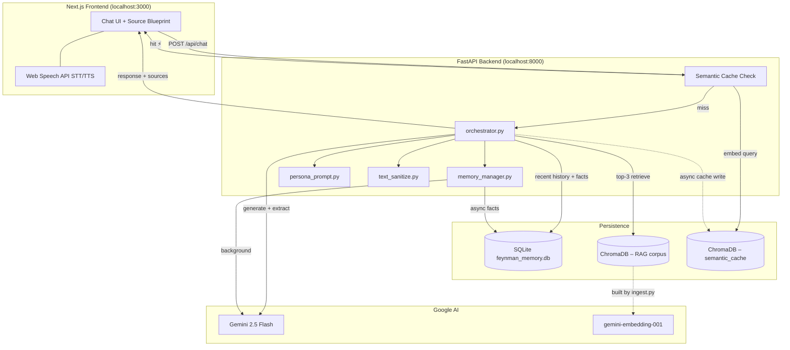

# Richard Feynman Digital Twin

> *"If you can't explain it simply, you don't understand it well enough."*
> — Richard P. Feynman

An AI-powered educational platform that channels Richard Feynman's legendary pedagogical style. Ask any physics question and receive an answer grounded in Feynman's own writings — complete with vivid analogies, adaptive tutoring, and voice interaction.

**Student:** Bibek Sanjeev · **Roll No.:** 25/B05/065 · **Course:** Digital Twin of a Scientist · **AIMS DTU 2026**

---

## Executive Summary

The Richard Feynman Digital Twin is a full-stack educational AI application engineered to simulate how Feynman actually taught — not merely how he sounded. Built on **Next.js**, **FastAPI**, **ChromaDB**, **SQLite**, and the **Gemini 2.5 Flash** API, the system goes far beyond a standard chatbot. An Advanced Retrieval-Augmented Generation (RAG) pipeline grounds every response in Feynman's actual publications. A dual-layer memory architecture tracks each learner's academic level across sessions, dynamically calibrating the complexity of explanations. A semantic caching engine intercepts rephrased questions at sub-millisecond latency. And a "Reverse Feynman" mode flips the classroom entirely — putting the student in the teaching seat and having the AI evaluate *their* explanation. The result is a context-aware, adaptive tutor that gets smarter about each user the longer they interact with it.

---

## Core Features

| Feature | Description |
|---|---|
| **Advanced RAG Pipeline** | Feynman's PhD thesis, QED papers, and lecture notes chunked, embedded with `gemini-embedding-001`, and stored in ChromaDB; top-3 semantic chunks retrieved per query. |
| **Dual-Layer Memory** | Short-term sliding window (last 10 messages) + asynchronous long-term extraction of user profile facts (academic level, knowledge gaps) persisted in SQLite. |
| **Persona Orchestration** | Master system prompt enforces a strict Jargon-to-Analogy rule (≤1 technical term per analogy), a 150-word conciseness constraint, and XML-structured output (`<technical_scratchpad>` / `<feynman_response>`). |
| **Multi-Modal Voice Interface** | Browser-native STT via `webkitSpeechRecognition` and TTS via `speechSynthesis` — zero backend latency, no external API. A Markdown-stripping regex pipeline cleans raw LLM output before audio synthesis for natural speech. |
| **Dual-Mode Pedagogy Engine** | **Tutor Mode** (default): Feynman explains. **Student Mode ("Reverse Feynman")**: AI evaluates *your* explanation, flags unjustified jargon, scores out of 10, and Socratically probes gaps — without giving answers directly. UI shifts to violet on mode switch. |
| **Semantic Caching Engine** | Custom ChromaDB cache collection intercepts semantically similar queries (L2 distance < 0.40) and returns instant responses, bypassing the LLM entirely. Cache writes happen asynchronously post-response. A ⚡ indicator flags cached replies in the UI. |
| **Visual Source Blueprint** | Sidebar dashboard animates the exact RAG document chunks (filename + snippet) used to construct each response, powered by Framer Motion. |
| **Memory Profile Panel** | Live sidebar view of the extracted user profile — what the twin knows about the learner's current level and gaps. |

---

## System Architecture

### Component Overview

```
┌─────────────────────────────────────────────────────────┐
│              Next.js Frontend  (localhost:3000)          │
│   Chat UI · Source Blueprint · Memory Panel · Voice     │
└──────────────────────┬──────────────────────────────────┘
                       │  POST /api/chat
┌──────────────────────▼──────────────────────────────────┐
│              FastAPI Backend  (localhost:8000)           │
│   orchestrator.py → memory_manager.py + persona_prompt  │
└────┬───────────────────────────────────────────┬────────┘
     │                                            │
┌────▼──────────────┐              ┌─────────────▼────────┐
│  Persistence       │              │    Google AI          │
│  SQLite (.db)      │              │  Gemini 2.5 Flash     │
│  ChromaDB          │              │  gemini-embedding-001 │
│  (RAG + Cache)     │              └──────────────────────┘
└───────────────────┘
```

### Request Flow (Single Chat Turn)

1. **Semantic Cache Check** — The incoming query is embedded and compared against the `semantic_cache` ChromaDB collection. If a match is found at L2 distance < 0.40, a cached response is returned immediately (⚡) and steps 2–6 are skipped entirely.
2. **Message Persistence** — On cache miss, the user message is saved to `chat_messages` in SQLite.
3. **RAG Retrieval** — Top-3 semantically relevant chunks are fetched from ChromaDB and packaged as sources for the UI.
4. **Prompt Assembly** — The system prompt combines the Feynman persona, extracted user facts, retrieved context, and the short-term conversation window.
5. **LLM Inference** — Gemini returns a `<technical_scratchpad>` block (logged server-side for debugging) and a `<feynman_response>` block (sanitized and sent to the UI).
6. **Background Tasks** — An async task extracts new user facts from the exchange and writes them to `user_profiles`. A second async task writes the QA pair to the semantic cache for future requests.

### Dual-Layer Memory Architecture

| Layer | Storage | Scope | Mechanism |
|---|---|---|---|
| **Short-Term** | SQLite `chat_messages` | Active session | Sliding window of last 10 messages, injected into context on every turn |
| **Long-Term** | SQLite `user_profiles` | Cross-session | Background Gemini prompt extracts implicit user traits (e.g., "first-year undergrad, struggles with linear algebra") after every message |

### Mermaid Architecture Diagram



---

## Repository Structure

```
Feynman-twin/
├── data/                        # Markdown knowledge corpus (committed)
├── docs/
│   └── design_decisions.md      # Technical rationale: chunking, memory, stack trade-offs
├── frontend/                    # Next.js app
│   └── ...                      # Chat UI, Source Blueprint, Memory Panel, Voice components
├── backend/
│   ├── rag/
│   │   ├── ingest.py            # Chunk, embed, and store corpus in ChromaDB
│   │   └── retrieve.py          # Semantic retrieval against RAG collection
│   ├── database/
│   │   ├── models.py            # SQLAlchemy ORM models
│   │   └── db.py                # Database session management
│   ├── main.py                  # FastAPI entrypoint and route definitions
│   ├── orchestrator.py          # Core twin response pipeline (cache → RAG → LLM)
│   ├── memory_manager.py        # Short-term window + long-term async fact extraction
│   ├── persona_prompt.py        # Master system prompt (Tutor & Student modes)
│   ├── gemini_client.py         # Custom SSL context for Gemini API connectivity
│   ├── text_sanitize.py         # Unicode normalization, quote escaping, JSON safety
│   ├── init_db.py               # SQLite schema initialization
│   └── fetch_feynman_data.py    # Automated corpus scraper
└── README.md
```

> **Do not commit:** `backend/chroma_db/`, `backend/*.db`, `backend/.env`

---

## Prerequisites

- **Node.js** 18+ and npm
- **Python** 3.11+
- A **Google AI Studio** API key with access to Gemini 2.5 Flash and `gemini-embedding-001`

---

## Quick Start

### 1. Clone and Configure Secrets

```bash
git clone https://github.com/bibrocks1/Feynman-twin
cd Feynman-twin
cp backend/.env.example backend/.env
```

Edit `backend/.env`:

```env
GEMINI_API_KEY=your_gemini_api_key_here
```

### 2. Backend Setup

```bash
cd backend
python -m venv venv

# Windows
venv\Scripts\activate

# macOS / Linux
source venv/bin/activate

pip install -r requirements.txt
python init_db.py
python rag/ingest.py
python main.py
```

API runs at **http://127.0.0.1:8000**

Health check: `GET http://127.0.0.1:8000/api/health`  
RAG test: `GET http://127.0.0.1:8000/api/test/rag?query=electron`

### 3. Frontend Setup

In a second terminal:

```bash
cd frontend
npm install
npm run dev
```

Open **http://localhost:3000** and ask a physics question.

---

## Environment Variables

| Variable | Location | Required | Description |
|---|---|---|---|
| `GEMINI_API_KEY` | `backend/.env` | Yes | Google AI key for chat inference, embedding, and background memory extraction |

---

## API Reference

### `POST /api/chat`

**Request:**

```json
{
  "message": "What is an electron?",
  "session_id": "optional-uuid-from-prior-response"
}
```

**Response:**

```json
{
  "session_id": "uuid",
  "response": "Sanitized Feynman reply text",
  "sources": [
    {
      "filename": "feynman_lectures_vol1.md",
      "friendly_name": "Feynman Lectures Vol1",
      "snippet": "First 150 characters of the retrieved chunk..."
    }
  ]
}
```

Responses served from the semantic cache will render a ⚡ indicator in the UI. The `sources` array will be empty for cached responses.

---

## Regenerating Local Data

| Task | Command |
|---|---|
| Reset SQLite schema | `python backend/init_db.py` |
| Rebuild vector index | `python backend/rag/ingest.py` |
| Fetch additional markdown sources | `python backend/fetch_feynman_data.py` |

---

## Technical Hurdles

Building a production-quality AI application surfaces real engineering problems. The following challenges were each solved with targeted, non-trivial fixes — not workarounds.

**SSL Certificate Blocks (Windows)**  
The Windows native trust store blocked outbound connections to both Wikipedia and the Gemini API during data acquisition. A custom SSL context in `gemini_client.py` was written to route requests cleanly, eliminating intermittent 500 server errors from the FastAPI layer.

**Encoding Panics & Rate Limiting**  
The ingestion pipeline crashed on `cp1252`-encoded Wikipedia data and frequently hit Gemini `429 Too Many Requests` limits. Both were resolved simultaneously: strict `UTF-8` encoding was enforced on all document loaders, and an automated batching system (8 chunks per batch, 4-second inter-batch delay) was implemented in `ingest.py`.

**JSON Serialization Failures**  
Consecutive apostrophes (`''`) and unescaped nested quotes in LLM output caused `JSON.parse()` failures on the Next.js client, triggering opaque UI crashes. `text_sanitize.py` was engineered to normalize Unicode, collapse irregular quote sequences, and guarantee valid JSON contracts via FastAPI's `JSONResponse` and Pydantic serialization before any data crosses the network.

**React State Race Condition**  
The Source Blueprint dashboard silently failed to render incoming RAG sources because Framer Motion's `AnimatePresence mode="wait"` property was blocking list state updates. The fix required stabilizing React state keys across renders and adding a `normalizeSources()` defensive parser in the Next.js API handler to prevent unstructured data from halting the component cycle.

**LLM Verbosity & Token Overhead**  
Early testing revealed the LLM defaulted to verbose, preamble-heavy responses that broke the Feynman persona and inflated token costs. A "Conciseness Constraint" and "Zero Fluff" directive were engineered directly into `persona_prompt.py`, capping responses at 150 words and mandating that the core concept and analogy appear before any other content.

---

## License & Attribution

Built as an academic project for **AIMS DTU 2026**. Feynman lecture excerpts and curated reference material in `data/` are used strictly for educational retrieval purposes. Respect original copyrights when extending the corpus. The application architecture and all custom code are the original work of the student author.
