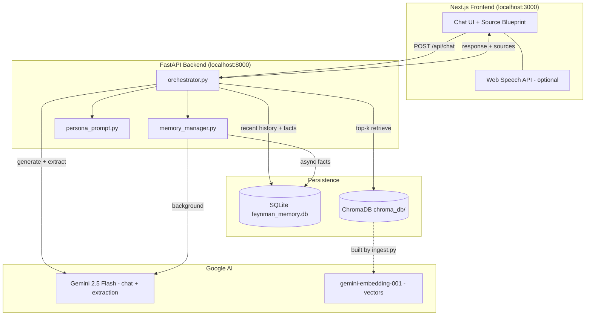

# Richard Feynman Digital Twin

An interactive teaching assistant that channels Richard Feynman's pedagogical style — built for the **AIMS DTU 2026** assignment. Students ask physics questions in a modern chat UI; the twin answers using retrieved excerpts from Feynman's lectures and writings, remembers learner context, and cites the exact sources that shaped each reply.

---

## Core features

| Feature | Description |
|---------|-------------|
| **Advanced RAG pipeline** | Markdown corpus in `data/` → chunked, embedded with Gemini, stored in **ChromaDB**; top-3 semantic retrieval per question. |
| **Semantic memory (SQLite)** | Short-term sliding window (10 messages) + background extraction of persistent user facts into `user_profiles`. |
| **Persona orchestration** | Master system prompt with jargon-to-analogy rules, XML-structured model output, and a single `generate_twin_response` pipeline. |
| **Visual dashboard** | **Memory Profile** sidebar + **Source Blueprint** showing filenames and snippets for the active RAG turn. |
| **Voice-ready UI** | Text chat today; designed for browser **Web Speech API** (STT/TTS) on the Next.js client without backend changes. |

---

## Architecture



**Request flow (one chat turn):**

1. User message saved to `chat_messages`.
2. RAG retrieves 3 chunks from Chroma; sources packaged for the UI.
3. System prompt = persona + user facts + retrieved context + history.
4. Gemini returns `<technical_scratchpad>` (logged server-side) + `<feynman_response>` (shown in UI).
5. Background task extracts new user facts into `user_profiles`.

---

## Repository structure

```
Feynman-twin/
├── data/                    # Markdown knowledge corpus (committed)
├── docs/
│   └── design_decisions.md  # Technical rationale
├── frontend/                # Next.js app
├── backend/
│   ├── rag/                 # ingest.py, retrieve.py
│   ├── database/            # SQLAlchemy models + db.py
│   ├── main.py              # FastAPI entrypoint
│   ├── orchestrator.py      # Twin response pipeline
│   ├── memory_manager.py    # Short + long-term memory
│   ├── persona_prompt.py    # Master system prompt
│   ├── init_db.py           # Create SQLite tables
│   └── fetch_feynman_data.py
└── README.md
```

---

## Prerequisites

- **Node.js** 18+ and npm  
- **Python** 3.11+  
- A **Google AI Studio** API key with access to Gemini 2.5 Flash and embeddings  

---

## Quick start

### 1. Clone and configure secrets

```bash
git clone <your-repo-url>
cd Feynman-twin
cp backend/.env.example backend/.env
```

Edit `backend/.env`:

```env
GEMINI_API_KEY=your_gemini_api_key_here
```

### 2. Backend setup

```bash
cd backend
python -m venv venv

# Windows
venv\Scripts\activate

# macOS / Linux
source venv/bin/activate

pip install -r requirements.txt
python init_db.py
python rag/ingest.py
python main.py
```

API runs at **http://127.0.0.1:8000**  
Health check: `GET http://127.0.0.1:8000/api/health`  
RAG test: `GET http://127.0.0.1:8000/api/test/rag?query=electron`

### 3. Frontend setup

In a second terminal:

```bash
cd frontend
npm install
npm run dev
```

Open **http://localhost:3000** and ask a physics question.

---

## Environment variables

| Variable | Location | Required | Description |
|----------|----------|----------|-------------|
| `GEMINI_API_KEY` | `backend/.env` | Yes | Google AI key for chat, embeddings, and memory extraction |

---

## API reference (chat)

**`POST /api/chat`**

```json
{
  "message": "What is an electron?",
  "session_id": "optional-uuid-from-prior-response"
}
```

**Response:**

```json
{
  "session_id": "uuid",
  "response": "Sanitized Feynman reply text",
  "sources": [
    {
      "filename": "feynman_lectures_vol1.md",
      "friendly_name": "Feynman Lectures Vol1",
      "snippet": "First 150 characters of the retrieved chunk..."
    }
  ]
}
```

---

## Regenerating local data

| Task | Command |
|------|---------|
| Reset SQLite schema | `python backend/init_db.py` |
| Rebuild vector index | `python backend/rag/ingest.py` |
| Fetch extra markdown sources | `python backend/fetch_feynman_data.py` |

Do **not** commit `backend/chroma_db/`, `backend/*.db`, or `backend/.env`.

---

## Design documentation

See [docs/design_decisions.md](docs/design_decisions.md) for chunking strategy, async memory extraction, Pydantic contracts, and stack trade-offs.

---

## License & attribution

Built as an academic project (AIMS DTU 2026). Feynman lecture excerpts and curated reference material in `data/` are used for educational retrieval; respect original copyrights when extending the corpus.
